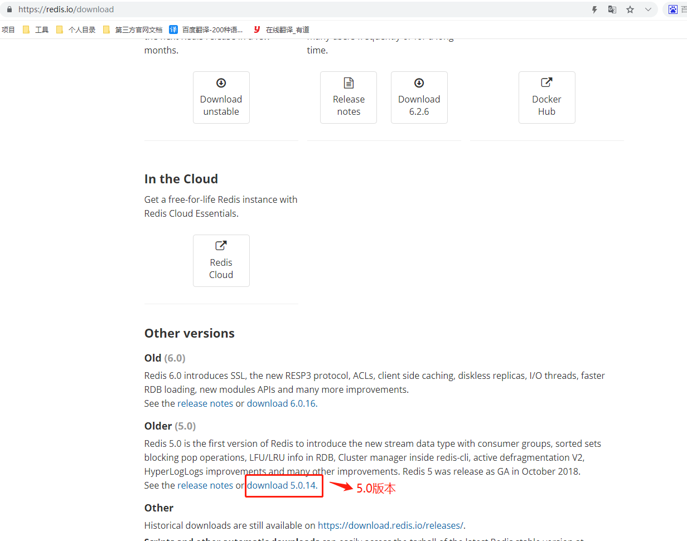

###  Linux 安装 Redis

Linux版本：

Redis版本: 5.0

### 1 Redis 下载

官网下载网页链接：https://redis.io/download

### 参考

    Redis集群 https://www.cnblogs.com/yufeng218/p/13688582.html

    Redis官网 https://www.redis.net.cn/tutorial/3501.html || https://redis.io/download
    
    Redis源码地址：https://github.com/redis/redis

