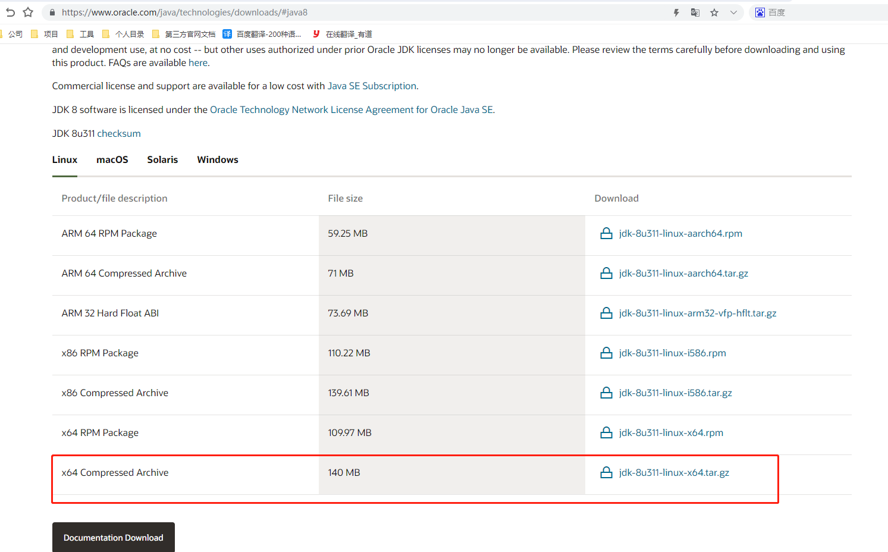
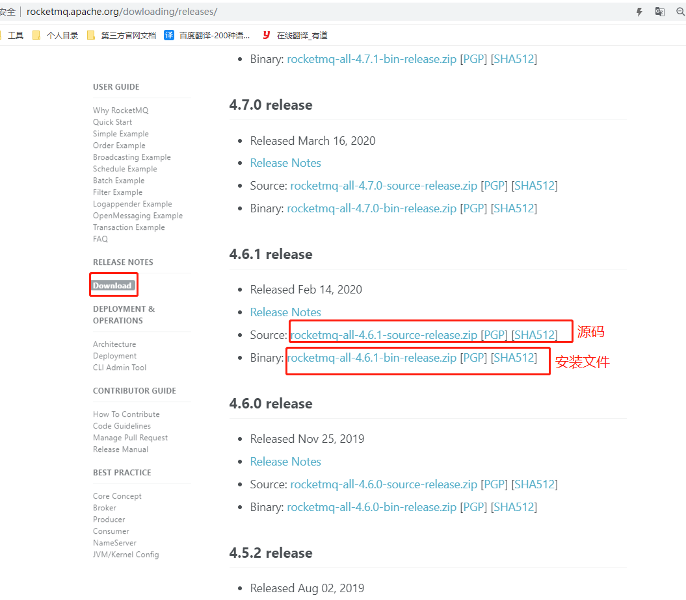
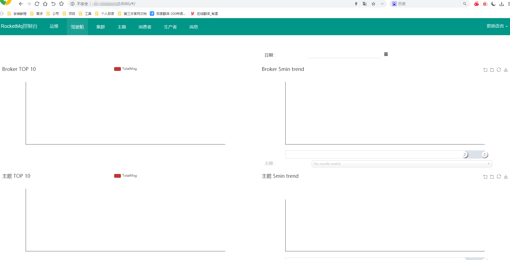

##  Linux安装Rocketmq教程

    Linux：conts7

    安装JDK8与Maven: RocketMQ java编写，需要java环境
        官网下载网页链接：https://www.oracle.com/technetwork/java/javase/downloads/jdk8-downloads-2133151.html

    Rocketmq版本: 5.0.14
        官网下载网页链接：https://redis.io/download
    
    Rocketmq开源项目(集群监控)：incubator-rocketmq-externals
        参考：https://www.jianshu.com/p/63f4062b661d

    mqadmin管理工具(命令操作)：
        进入RocketMQ安装位置，在bin目录下执行
        ./mqadmin {command} {args}

启动与关闭

    1：启动命令：
        nohup sh mqnamesrv >/usr/local/rocketmq/rocketmq-4.6.1/log/mqnamesrv.log 2>&1 &
        nohup sh mqbroker -c /usr/local/rocketmq/rocketmq-4.6.1/conf/broker.conf >broker.log 2>&1 &
        nohup java -jar rocketmq-console-ng-1.0.0.jar --rocketmq.config.namesrvAddr='ip:9876' >out.log 2>&1 &
    
    2：关闭命令： 
        关闭namesrv服务：sh mqshutdown namesrv
        关闭broker服务 ：sh mqshutdown broker

### 1 Linux安装JDK8

linux位数：getconf LONG_BIT

JDK8官网下载网页链接：https://www.oracle.com/technetwork/java/javase/downloads/jdk8-downloads-2133151.html

    cd /usr/local

    Xshell上传：rz

    tar -zxvf  jdk-8u311-linux-aarch64.tar.gz

    修改环境变量
    vim /etc/profile
    export JAVA_HOME=/usr/local/jdk1.8.0_311
    export JRE_HOME=${JAVA_HOME}/jre
    export CLASSPATH=.:${JAVA_HOME}/lib:${JRE_HOME}/lib:$CLASSPATH
    export JAVA_PATH=${JAVA_HOME}/bin:${JRE_HOME}/bin
    export PATH=$PATH:${JAVA_PATH}

    刷新配置
    source /etc/profile

maven 安装省略，我编译打包使用的windows本地环境。

### 2 Rocketmq 下载安装

2.1 下载

http://rocketmq.apache.org/dowloading/releases/

2.2 Xshell上传zip并解压

    切换目录：cd /usr/local

    创建rocketmq文件夹：mkdir rocketmq
     
    切换目录： cd rocketmq
    
    Xshell上传：rz 

    解压zip: unzip rocketmq-all-4.4.0-bin-release.zip

    更改解压目录名称： mv rocketmq-all-4.6.1-bin-release rocketmq-4.6.1

    cd /usr/local/rocketmq/rocketmq-4.6.1/bin

    启动参数:虚拟机内存不够，可能启动失败，可以更改内存。（服务器上不需要改）
    vi runserver.sh
         #JAVA_OPT="${JAVA_OPT} -server -Xms4g -Xmx4g -Xmn2g -XX:MetaspaceSize=128m -XX:MaxMetaspaceSize=320m"
         改为：
         #JAVA_OPT="${JAVA_OPT} -server -Xms128M -Xmx128M -Xmn128M -XX:MetaspaceSize=128m -XX:MaxMetaspaceSize=128M"

    vi runbroker.sh
        #JAVA_OPT="${JAVA_OPT} -server -Xms8g -Xmx8g -Xmn4g"
        改为：
        JAVA_OPT="${JAVA_OPT} -server -Xms128M -Xmx128M -Xmn128M"

### 3 Rocketmq启动

Rocketmq配置文件：/usr/local/rocketmq/rocketmq-4.6.1/conf/broker.conf

3.1 bin目录下启动nameserve

    切换目录：cd /usr/local/rocketmq/rocketmq-4.6.1/bin

    启动nameserve： nohup sh mqnamesrv &
    
    启动是否成功的日志命令：tail -f ~/logs/rocketmqlogs/namesrv.log

3.2 bin目录下启动broker

    切换目录： cd /usr/local/rocketmq/rocketmq-4.6.1/bin

    选择配置文件启动broker：
        nohup sh mqbroker -n localhost:9876
        或者
        nohup sh mqbroker -c /usr/local/rocketmq/rocketmq-4.6.1/conf/broker.conf >broker.log 2>&1 &

    netstat -ntlp

    查看日志命令：tail -f ~/logs/rocketmqlogs/broker.log
    查看启动状态：jps

3.3  防火墙已放行端口9876与8086 ：

    （1）如我们需要开启XShell连接时需要使用的9876端口与8086端口
    firewall-cmd --zone=public --add-port=9876/tcp --permanent
    firewall-cmd --zone=public --add-port=8086/tcp --permanent
    其中--permanent的作用是使设置永久生效，不加的话机器重启之后失效
    （2）重新载入一下防火墙设置，使设置生效
    firewall-cmd --reload
    （3）可通过如下命令查看是否生效
    firewall-cmd --zone=public --query-port=9876/tcp
    firewall-cmd --zone=public --query-port=8086/tcp

### 4 rocketmq-console下载、部署

    本地需要jdk与maven

#### 4.1 下载rocketmq-console,在本地编译后打包成jar

##### 4.1.1 下载

git地址：https://github.com/apache/rocketmq-externals/tree/release-rocketmq-console-1.0.0

    clone： git clone https://github.com/apache/rocketmq-externals.git

    进入rocketmq-externals下切换到分支：git checkout release-rocketmq-console-1.0.0

**项目**：rocketmq-console

##### 4.1.2 修改配置文件application.properties

    #访问端口
    server.port=8086
    
    ### SSL setting  默认就行
    #server.ssl.key-store=classpath:rmqcngkeystore.jks
    #server.ssl.key-store-password=rocketmq
    #server.ssl.keyStoreType=PKCS12
    #server.ssl.keyAlias=rmqcngkey
    
    #spring.application.index=true
    spring.application.name=rocketmq-console
    spring.http.encoding.charset=UTF-8
    spring.http.encoding.enabled=true
    spring.http.encoding.force=true
    #logback配置文件路径，先默认即可
    logging.config=classpath:logback.xml
    #if this value is empty,use env value rocketmq.config.namesrvAddr  NAMESRV_ADDR | now, you can set it in ops page.default localhost:9876
    #Name Server地址，修改成你自己的服务地址。多个地址用英文分号“;”隔开
    rocketmq.config.namesrvAddr=localhost:9876
    #if you use rocketmq version < 3.5.8, rocketmq.config.isVIPChannel should be false.default true
    rocketmq.config.isVIPChannel=
    #rocketmq-console's data path:dashboard/monitor
    rocketmq.config.dataPath=/tmp/rocketmq-console/data
    #set it false if you don't want use dashboard.default true
    rocketmq.config.enableDashBoardCollect=true
    #set the message track trace topic if you don't want use the default one
    rocketmq.config.msgTrackTopicName=
    rocketmq.config.ticketKey=ticket
    
    #Must create userInfo file: ${rocketmq.config.dataPath}/users.properties if the login is required
    rocketmq.config.loginRequired=false

##### 4.1.3  编译后打包jar

    java打包，该出不再单独说明，可以使用idea协助编译打包。

    mvn clean package -Dmaven.test.skip=true

#### 4.2 上传到linux并启动
 
    切换目录：cd /usr/local/rocketmq/
    
    Xshell上传：rz
    
    启动：nohup java -jar rocketmq-console-ng-1.0.0.jar >out.log 2>&1 &
    
    注释：
        #如果配置文件没有填写Name Server的话，可以在启动项目时指定namesrvAddr
        $ nohup java -jar rocketmq-console-ng-1.0.0.jar --rocketmq.config.namesrvAddr='ip:9876' >out.log 2>&1 &
        
        #因为本文在打包时配置了namesrvAddr，故而执行如下命令
        $ nohup java -jar rocketmq-console-ng-1.0.0.jar >out.log 2>&1 &

执行成功，访问页面：

    http://ip:8086/rocketmq

### 5 控制台的使用

### 参考

    Rocketmq源码(重点)：https://github.com/apache/rocketmq/tree/master/docs/cn
 
    Rocketmq官网：http://rocketmq.apache.org/
    
    Rocketmq文档：rocketmq文档地址：http://rocketmq.apache.org/docs/quick-start/

    安装教程：https://blog.csdn.net/darendu/article/details/103539968 
             https://blog.csdn.net/qq_41463655/article/details/101907665
             https://blog.csdn.net/so_geili/article/details/90142461

    https://www.jianshu.com/p/5f70e34448ce