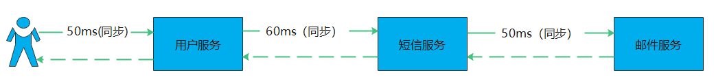
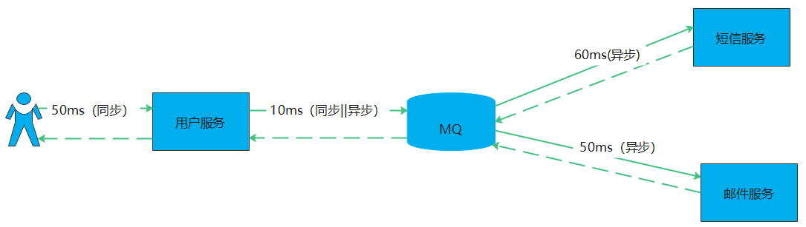
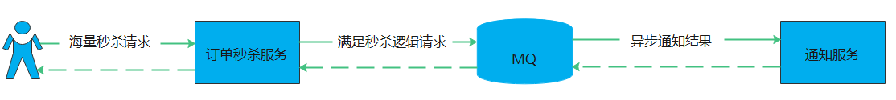
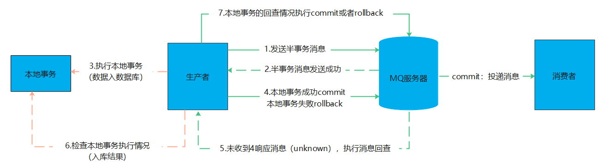
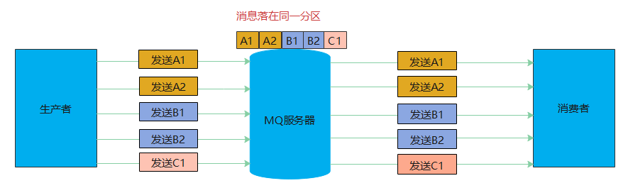
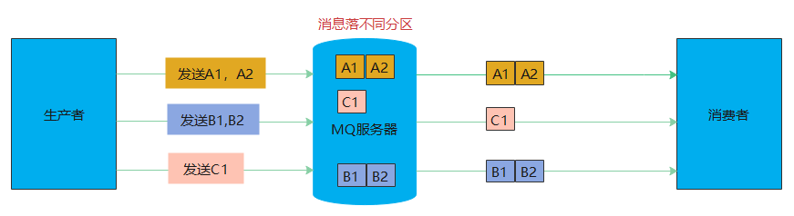
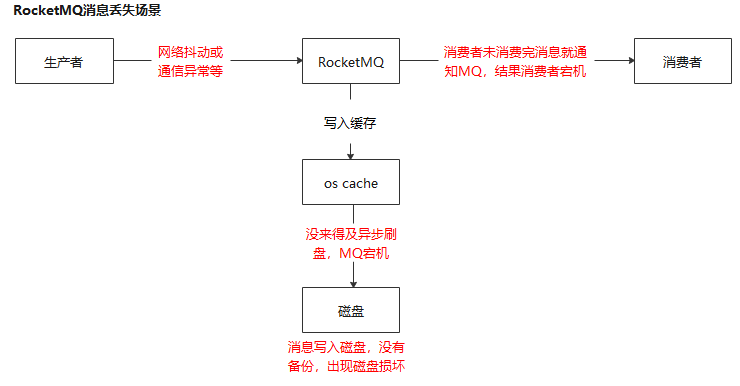
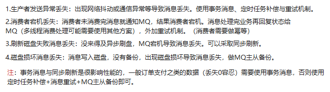

##  Rocketmq 介绍

Rocketmq 介绍与常见问题汇总。

**源码地址见**：

    1、测试项目github地址：https://github.com/zlk-github/common-test/tree/master/common-rocketmq-test
    2、公共包github地址：git@github.com:zlk-github/common.git    --(https://github.com/zlk-github/common/tree/master/common-rocketmq)

### 1 Redis 介绍

RocketMQ是一款分布式消息中间件,最初是由阿里消息中间件团队开发，解决线上海量数据堆积问题。2016捐赠到Apache下成为孵化项目。

RocketMQ默认采用长轮询的拉模式，单机可以支持千万级别数据的消息堆积。单机呑吐量理论上接近10W级别。

#### 1.1 MQ 比较（优劣）

#### 1.2 Rocketmq介绍与基本概念

1.2.1 消息模型（Message Model）

    主要由消息生产者（Producer），消息消费者（Consumer ），代理服务器（Broker ）三部分组成。生产者负责生产消息，
    代理服务器负责存储消息，代理服务器在实际部署中对应一台服务器，每个代理服务器可以存放多个主题（Topic）的消息。
    每个主题的消息可以分片存放到不同的代理服务器上。Message Queue 用于存储消息的物理地址，每个主题中的消息中的信息存储于多个Message Queue中。
    消费者组(ConsumerGroup) 由多个消费者实例构成。

1.2.2 消息生产者（Producer）

    负责生产消息发送到broker服务器。提供同步消息、异步消息、顺序消息、单向消息、事务消息、过滤消息与批量消息等。
    其中同步和异步方式均需要Broker返回确认信息，单向发送不需要（不能保证必达，效率高）。

1.2.3 消息消费者（Consumer）

    负责消费broker服务器中的消息，从MQ拉取消息进行消费。
    提供两种消费形式：拉取式消费、推送式消费

1.2.4 主题（Topic）

    一类消息的集合，每个主题包含若干条消息，每条消息只能属于一个主题，是RocketMQ进行消息订阅的基本单位。

1.2.5 代理服务器（Broker Server）

    消息中转角色，负责存储与转发消息。
    代理服务器也存储消息相关的元数据，包括消费者组、消费进度偏移和主题和队列消息等。

    Broker部署相对复杂，Broker分为Master与Slave，一个Master可以对应多个Slave，但是一个Slave只能对应一个Master，
    Master与Slave 的对应关系通过指定相同的BrokerName，不同的BrokerId 来定义，BrokerId为0表示Master，非0表示Slave。Master也可以部署多个。
    每个Broker与NameServer集群中的所有节点建立长连接，定时注册Topic信息到所有NameServer。 
    注意：当前RocketMQ版本在部署架构上支持一Master多Slave，但只有BrokerId=1的从服务器才会参与消息的读负载。

1.2.6 名字服务（Name Server）

    名称服务充当路由消息的提供者。生产者或消费者能够通过名字服务查找各主题相应的Broker IP列表。
    多个Namesrv实例组成集群，但相互独立，没有信息交换。

1.2.7 拉取式消费（Pull Consumer）

    一种消费类型，消费者主动从Broker服务器拉取消息进行消费。批量获取消息。

1.2.8 推动式消费（Push Consumer）

    一种消费类型，Broker服务器收到数据后会主动推送给消费端，该消费模式一般实时性较高。

1.2.9 生产者组（Producer Group）

    同一类生产者的集合，如果发送事务消息后原生产者崩溃，Broker服务器可以联系同一类生产者组的其他生产者做提交与回溯消费（事务提交与回滚）。

1.2.10 消费者组（Consumer Group）

    同一类消费者的集合，用于负载均衡与容错。消费者必须订阅相同的topic。消费模式：集群消费与广播消费。

1.2.11 集群消费（Clustering）|| 广播消费（Broadcasting）

    集群消费模式下,相同Consumer Group的每个Consumer实例平均分摊消息。不同的消费组也是全量消息。
    广播消费模式下，相同Consumer Group的每个Consumer实例都接收全量的消息。（少见）

1.2.12 普通顺序消息（Normal Ordered Message）|| 严格顺序消息（Strictly Ordered Message）

    普通顺序消费模式下，消费者通过同一个消息队列（ Topic 分区，称作 Message Queue） 收到的消息是有顺序的，不同消息队列收到的消息则可能是无顺序的。
    严格顺序消息模式下，消费者收到的所有消息均是有顺序的。

1.2.13 消息（Message）

    信息的载体，生产与消费的最小单位，消息必须属于一个Topic。
    RocketMQ中每个消息拥有唯一的Message ID（存在问题，不要作为业务去重），且可以携带具有业务标识的Key（顺序消息与幂等使用）。
    系统提供了通过Message ID和Key查询消息的功能。

1.2.14 标签（Tag）

    topic的一个补充，一个topic下可以有不同类型的消息。可以根据业务设置不同类型的标签，消费者可以根据标签实现不同的消费逻辑拓展。

1.2.15 分区（partition）

    topic分区partition，可以认为是一个Broker服务器是一个分区。

#### 1.3 RocketMQ实现原理

#### 1.4 Rocketmq 常见问题

    Rocketmq 使用场景
    RocketMQ消费模式有几种
    消息异步情况下的可靠性传输
        生产者丢失：消息重试，RocketMQ事务，定时任务补偿(对前两个的补充)。
        MQ丢失：数据同步刷新（使用少），MQ集群备份。
        消费者丢失：消息消费业务结束再回复状态给MQ。
    消费失败大量积压的数据怎么解决，积压到磁盘上线，数据被删除了怎么办。
    RocketMQ为什么速度快
    重复消费和幂等性问题
    高可用实现与数据同步（见1.3）
    RocketMQ实现原理（见1.5）

##### 1.4.1 Rocketmq 使用场景
 
异步解耦，流量削锋，分布式事务的数据一致性，顺序消息，大规模机器的缓存同步。

    异步解耦：串行变并行，如短信、邮件、日志（日志一般用elk）等，缩短接口响应速度。
            和第三方平台解耦，做中间数据交互，达到跨语言跨系统交互。
    流量削锋：下单秒杀等,满足的条件消息先进入MQ排队，不满足丢弃。再通过消费者消费消息返回结果给用户，避免海量请求压垮服务与数据库。
    分布式事务的数据一致性：分布式事务最终一致性。
    顺序消息：全局顺序（topic下有序），全局顺序（key下有序）。
    大规模机器的缓存同步：如数据变动较大，数据多且访问量高的数据。这时候会导致缓存服务器满载，可以选择使用Mq的广播模式，将消息同步到每台机器，取代缓存。
                       （适用于不同服务使用到公共的数据）

1）异步解耦

2）流量削锋

3）分布式事务的数据一致性

    事务消息：RocketMQ采用了2PC的思想来实现了提交事务消息，同时增加一个补偿逻辑来处理二阶段超时或者失败的消息。
            （不支持延时消息和批量消息）

4）顺序消息

    注：顺序消息只支持同步消息，且需要保证消息发送时候顺序（即多线程发送可能导致发送消息顺序不一致）

全局顺序消息

    全局顺序消息（topic下有序，需要控制读写队列数量为1）
    全局顺序：适用于性能要求不高，所有的消息严格按照FIFO原则来发布和消费的场景。需要控制读写队列数量为1

分区顺序消息

    分区有序顺序消息（一个topic下，Sharding Key下有序）
    局部顺序：适用于性能要求高，以Sharding Key作为分区字段，在同一个区块中严格地按照 FIFO 原则进行消息发布和消费的场景。

5）大规模机器的缓存同步

    大规模机器的缓存同步：如数据变动较大，数据多且访问量高的数据。这时候会导致缓存服务器满载，可以选择使用Mq的广播模式，将消息同步到每台机器，取代缓存。
                      （适用于不同服务使用到公共的数据）

##### 1.4.2 RocketMQ为什么速度快

##### 1.4.3 RocketMQ消费模式有几种
 
    集群消费：启动多个消费者服务，同一消费者组平均消费分摊消息（同一消费者消费同一个topic下消息）
    广播消费：启动多个消费者服务，同一消费者组全量消费消息（同一消费者消费同一个topic下消息）

##### 1.4.4 RocketMQ消息可靠传输（0丢失）

消息丢失场景

解决方案

##### 1.4.5 RocketMQ消费失败大量积压与消息被删除的解决

1.消息允许丢弃，修改代码不处理消息直接丢弃，除非MQ顶不住，能够重推数据到MQ的场景。（实际中很少见）

2.消息不允许丢弃，生产者限流、mq扩容分区（一个topic的消息均分到不同mq服务器上）、增加消费者服务加快对消息的消费。（耗时久，甚至要几个小时）
  这时可以考虑增加一个消费者将MQ再次分发。甚至可以先将消息消费到别的地方做处理。

注：

    除去故障排除恢复等。生产者producer限流，RocketMQ扩容，消费者consumer扩容。
    1. 需要解决性能瓶颈，如数据库等。
    2. 优化耗时代码。
    3. 增加消费能力（如增加消费者，使用多线程等等，很多时候数据库也会成为瓶颈）。
    4.一个Topic是由分散在多台broker上的Pratition组成的，多台Produer按照一定的算法把消息发送给各个Partition上，consumer按照一定的算法去消费不同pratition上的消息。
     每一个Pratition最大允许一个consumer去消费，一个consumer可以消费多个Pratition。
    5.当消费速度小于生产速度的时候，仅增加消费者是没有用处的，因为多个消费者在同一个分区上实际是单线程资源竞争关系
    （当然还有一些冒险的单队列多消费者并行方式就是：消费者接到消息就ack成功再去处理业务逻辑，这样你就要承受消息丢失的代价），我们需要同时增加Broker上的分区数量才能解决这一问题。

##### 1.4.6 RocketMQ消息之顺序消息

    RocketMQ消息有同步消息、异步消息、顺序消息、单向消息、事务消息、过滤消息与批量消息等。以下介绍顺序消息。

##### 1.4.7 RocketMQ消费者之重复消费和幂等性问题

    msgId一定是全局唯一标识符，但是实际使用中，可能会存在相同的消息有两个不同msgId的情况（消费者主动重发、因客户端重投机制导致的重复等），
    这种情况就需要使业务字段进行重复消费。

    实际业务中，可以对数据库字段做唯一键且入库前加业务关键字字段缓存（如订单id存入redis）去重。

#### 1.5 限流(待完善)

    参考https://www.jianshu.com/p/7f4fb12466b5

#### 1.6 高可用实现与数据同步

   参考：https://www.cnblogs.com/xwgblog/p/14055449.html

1.6.1 命名服务（NameServer）做多部署

1.6.2 Broker 集群部署架构

    1. 多主模式
      集群无Slave，全是Maste。
      优点：配置简单，单个Master宕机或重启维护对应用无影响，在磁盘配置为RAID10 时，即使机器宕机不可恢复情
      由于RAID10 磁盘非常可靠，消息也不会丢（异步刷盘丢失少量消息，同步刷盘一条不丢）。性能最高。
      缺点：单台机器宕机期间，这台机器上未被消费的消息在机器恢复之前不可订阅，消息实时性会受到受到影响。

    2.M/S 单主单从模式
      主从模式分为同步模式和异步模式，区别是在同步模式下只有主从复制完毕才会返回给客户端；
      而在异步模式中，主从的复制是异步的，不用等待即可返回。

    3. 多主多从模式-异步复制 模式
      每个Master配置一个Slave，有多对Master-Slave，HA采用异步复制方式，主备有短暂消息延迟（毫秒级）
      优点：即使磁盘损坏，消息丢失的非常少，且消息实时性不会受影响，同时Master宕机后，消费者仍然可以从Slave消费，而且此过程对应用透明，不需要人工干预，性能同多Master模式几乎一样；
      缺点：Master宕机，磁盘损坏情况下会丢失少量消息。
            
    4 多主多从模式-同步双写 模式
      每个Master配置一个Slave，有多对Master-Slave，HA采用同步双写方式，即只有主备都写成功，才向应用返回成功
      优点：数据与服务都无单点故障，Master宕机情况下，消息无延迟，服务可用性与数据可用性都非常高；
      缺点：性能比异步复制模式略低（大约低10%左右），发送单个消息的RT会略高，且目前版本在主节点宕机后，备机不能自动切换为主机。

    5 Dledger部署（优先)
      RocketMQ 4.5 以前的版本大多都是采用 Master-Slave 架构来部署，能在一定程度上保证数据的不丢失，也能保证一定的可用性。
      但是那种方式 的缺陷很明显，最大的问题就是当 Master Broker 挂了之后 ，没办法让 Slave Broker 自动 切换为新的 Master Broker，
      需要手动更改配置将 Slave Broker 设置为 Master Broker，以及重启机器，这个非常麻烦。
  
      在手式运维的期间，可能会导致系统的不可用。
  
      使用 Dledger 技术要求至少由三个 Broker 组成 ，一个 Master 和两个 Slave，这样三个 Broker 就可以组成一个 Group ，
      也就是三个 Broker 可以分组来运行。一但 Master 宕机，Dledger 就可以从剩下的两个 Broker 中选举一个 Master 继续对外提供服务。

### 参考
