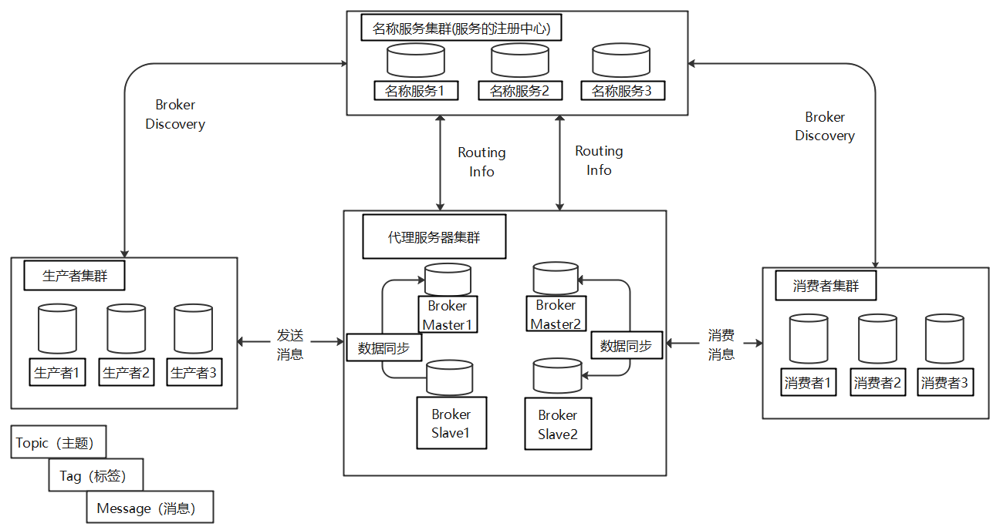

##  Spring Boot 如何集成RocketMQ

Spring Boot 如何集成RocketMQ做消息队列

**源码地址见**：

    1、测试项目github地址：https://github.com/zlk-github/common-test/tree/master/common-rocketmq-test
                         生产者见：https://github.com/zlk-github/common-test/tree/master/common-rocketmq-test/commom-rocketmq-producer
                         消费者见：https://github.com/zlk-github/common-test/tree/master/common-rocketmq-test/commom-rocketmq-consumer
    2、公共包github地址：git@github.com:zlk-github/common.git     --(https://github.com/zlk-github/common)

Rocketmq版本: 4.9.1

### 1 RocketMQ 简单介绍

    RocketMQ主要由消息生产者（Producer），消息消费者（Consumer ），代理服务器（Broker ）三部分组成。生产者负责生产消息，
    代理服务器负责存储消息，代理服务器在实际部署中对应一台服务器，每个代理服务器可以存放多个主题（Topic）的消息。
    每个主题的消息可以分片存放到不同的代理服务器上。Message Queue 用于存储消息的物理地址，每个主题中的消息中的信息存储于多个Message Queue中。
    消费者组(ConsumerGroup) 由多个消费者实例构成。



RocketMQ消费主要分为集群消费模式与广播消费模式。

    集群消费模式下,相同Consumer Group的每个Consumer实例平均分摊消息。
    广播消费模式下，相同Consumer Group的每个Consumer实例都接收全量的消息。

消息分类：普通消息、顺序消息、延时消息、过滤消息、事务消息、批量消息等。
    
    普通消息：生产者直接把消息放在topic下，消费者直接对topic下所有消息消费。
    顺序消息：RocketMQ可以严格的保证消息有序，可以分为分区有序(设置key)或者全局有序。
    延时消息：生产者发送延时消息到topic下，延时消息会等待到达设置时间后才会被消费者消费。
    过滤消息：生产者发送延时消息到topic下并使用tag标记分类，消费者可以设置tag，对topic下对应条件的tag绑定消息消费（支持简单语法）。
    事务消息：RocketMQ采用了2PC的思想来实现了提交事务消息，同时增加一个补偿逻辑来处理二阶段超时或者失败的消息。（不支持延时消息和批量消息）
    批量消息：主要是为了减少网络开销，批量提交。有长度限制。默认小于4MB。

每个服务中不能存在多个相同的Consumer Group。但是可以多个Consumer Group消费一个Topic(一般不要这样做，除非是广播消费场景)。--待测试

### 2 Spring Boot 2.0集成 RocketMQ

#### 2.1 引入POM

只包含RocketMQ依赖。

```xml
<!--RocketMQ依赖-->
<dependency>
    <groupId>org.apache.rocketmq</groupId>
    <artifactId>rocketmq-spring-boot-starter</artifactId>
    <version>2.2.1</version>
</dependency>
<!--<dependency>
    <groupId>org.apache.rocketmq</groupId>
    <artifactId>rocketmq-client</artifactId>
    <version>4.9.1</version>
</dependency>-->
```

#### 2.2 实体类User

```java
package com.zlk.core.model.vo;

import io.swagger.annotations.ApiModel;
import io.swagger.annotations.ApiModelProperty;
import lombok.Data;

import java.io.Serializable;
import java.time.LocalDateTime;

/**
* @author  likuan.zhou
* @title:  用户VO
* @description: User对象
* @date 2021-09-14
*/
@Data
@ApiModel(value="用户VO", description="用户VO")
public class UserVO implements Serializable {

    private static final long serialVersionUID = 1L;

    @ApiModelProperty(value = "主键")
    private Long id;

    @ApiModelProperty(value = "名称")
    private String name;

    @ApiModelProperty(value = "有效状态（0禁用，1启用）")
    private Integer status;

    @ApiModelProperty(value = "创建者id")
    private String createBy;

    @ApiModelProperty(value = "创建时间")
    private LocalDateTime createTime;

    @ApiModelProperty(value = "更新者id")
    private String updateBy;

    @ApiModelProperty(value = "更新时间")
    private LocalDateTime updateTime;
}
```
#### 2.3 业务类（用于测试事务消息）

```java
// 接口
public interface OrderService {

    /**
     * 插入数据
     * @param order 订单
     */
    void add(Order order) throws Exception;

    /**
     * 更新数据
     * @param order 订单
     */
    void update(Order order);

    /**
     * id 获取数据
     * @param id id
     */
    Order getById(Long id);
}

// 实现类
@Service
public class OrderServiceImpl implements OrderService {
    // hashMap线程不安全 速度快(HashMap 适用于单线程操作数据)。多线操作HashMap，我们通过加锁或者加入同步控制依然能正常应用HashMap，只是需要加上同步操作的代价。
    // concurrentMap线程安全 速度慢 分段锁 不是整体锁(concurrentMap适用于多个线程同时要操作一个map的数据). 但是不能保证线程同步顺序。
    private static final ConcurrentHashMap<Long,Order> MAP = new ConcurrentHashMap<>();
    @Override
    public void add(Order order) throws Exception {
        // 模拟入库
        MAP.put(order.getId(),order);
        // 模拟入库异常
        if(order.getId()%2 == 0) {
            throw new Exception();
        }
    }

    @Override
    public void update(Order order) {
        // 模拟更新
        MAP.put(order.getId(),order);
    }

    @Override
    public Order getById(Long id) {
        // 模拟读取
        return MAP.get(id);
    }
}
```
#### 2.4 常量类

```java
/**
 * RocketMQ常量
 * @author likuan.zhou
 * @date 2021/10/9/009 13:38
 */
public interface RocketMQConstant {

    // 集群模式--（1对1）
    // 主题(一组消息存放在top中，每个服务器可以配置多个TOP)
    String TOPIC_1 = "clustering-topic1";
    // 主题(一组消息存放在top中，每个服务器可以配置多个TOP)
    String TOPIC_2 = "clustering-topic2";
    String TOPIC_3 = "clustering-topic3";
    String TOPIC_4 = "clustering-topic4";
    String TOPIC_5 = "clustering-topic5";
    String TOPIC_6 = "clustering-topic6";
    String TOPIC_7 = "clustering-topic7";
    String TOPIC_8 = "clustering-topic8";

    // 标签(同一主题下区分不同类型的消息)
    String TAG_1 = "clustering-tag1";
    // 标签(同一主题下区分不同类型的消息)
    String TAG_2 = "clustering-tag2";

}
```

#### 2.5 生产者配置application.yaml

```yaml
#服务端口
server:
    port: 8031

################配置################
spring:
    application:
        #服务名称
        name: rocketmq-consumer-service

################swagger2配置################
#是否激活 swagger true or false
swagger:
    enable: true


################rocketmq配置################
#而且注意这里不要写为spring.rocketmq.producer.group，这个版本的写法不一样（rocketmq-spring-boot-starte2.0.4）
################rocketmq配置(生产者)################
# 注rocketmq的生产组不是消费组
rocketmq :
    # mq的nameserver地址
    name-server: 47.119.180.152:9876
    # 生产者配置
    producer:
        # 发送同一类消息设置为同一个group，保证唯一默认不需要设置，rocketmq会使用ip@pid（pid代表jvm名字）作为唯一标识
        group: "rocketmq_producer_group"
        # 发送消息超时时间，默认 3000
        send-message-timeout: 3000
        # 发送消息失败重试次数，默认2
        retry-times-when-send-async-failed: 2
        # 消息最大长度 默认1024*4(4M)
        maxMessageSize: 4096
```


#### 2.6 消费者者配置application.yaml

```yaml
#服务端口
server:
    port: 8057

################配置################
spring:
    application:
        #服务名称
        name: rocketmq-consumer-service

################swagger2配置################
#是否激活 swagger true or false
swagger:
    enable: true


################rocketmq配置（消费者）################
# 注rocketmq的消费组不是生产组
# 每一个消费组对应消费一个Topic或者Topc下的一组tag。
# 不要一个消费者消费不同的Tiopc或者多组Topc下的tag集合。
rocketmq :
    # mq的nameserver地址
    name-server: 47.119.180.152:9876
    consumer:
        # 发送同一类消息设置为同一个group
        group1: "rocketmq_consumer_group_1001"
        group2: "rocketmq_consumer_group_1002"
        group3: "rocketmq_consumer_group_1003"
        group4: "rocketmq_consumer_group_1004"
        group5: "rocketmq_consumer_group_1005"
        group6: "rocketmq_consumer_group_1006"
        group7: "rocketmq_consumer_group_1007"
        group8: "rocketmq_consumer_group_1008"
```

#### 2.7 生产者

#### 2.7.1 非事务消息生产者

```java
package com.zlk.producer.controller;

import com.zlk.core.model.constant.RocketMQConstant;
import com.zlk.core.model.vo.UserVO;
import com.zlk.producer.config.ExtRocketMQTemplate;
import io.swagger.annotations.Api;
import io.swagger.annotations.ApiOperation;
import lombok.extern.slf4j.Slf4j;
import org.apache.rocketmq.client.producer.DefaultMQProducer;
import org.apache.rocketmq.client.producer.SendCallback;
import org.apache.rocketmq.client.producer.SendResult;
import org.apache.rocketmq.client.producer.TransactionSendResult;
import org.apache.rocketmq.common.CountDownLatch2;
import org.apache.rocketmq.common.message.Message;
import org.apache.rocketmq.spring.core.RocketMQTemplate;
import org.springframework.beans.factory.annotation.Autowired;
import org.springframework.messaging.support.MessageBuilder;
import org.springframework.web.bind.annotation.*;

import java.nio.charset.StandardCharsets;
import java.util.List;
import java.util.concurrent.TimeUnit;

/**
 * 生产者--生产消息，发送到MQ
 * @author likuan.zhou
 * @date 2021/11/1/001 8:33
 */
@RestController
@RequestMapping("producer")
@Slf4j
@Api(tags = "生产者")
public class ProducerController {
    // swagger : http://localhost:8031/swagger-ui.html
    // 同一台机器的同一条消息，MsgId是不一定一样，不要用来做业务。需要的话自己设置key。

    // 当前未配置
    @Autowired
    private DefaultMQProducer mqProducer;

    // 使用下面这个模板即可
    @Autowired
    private RocketMQTemplate rocketMQTemplate;

    // 用于测试事务消息
    @Autowired
    private ExtRocketMQTemplate extRocketMQTemplate;

    @PostMapping("/sync/send")
    @ApiOperation("发送同步消息，需要等待Broker的响应")
    public void syncSend(@RequestParam String msg){
        try {
            // 1 同步发送。需要等待Broker的响应 --（常规下使用最多）
            // TOP主题与消息（默认发送超时时间为3秒）
            SendResult send = rocketMQTemplate.syncSend(RocketMQConstant.TOPIC_1, msg);
            log.info("消息发送成功。msgId:{}",send.getMsgId());
        }catch (Exception ex) {
            log.error("消息发送失败，MQ主机信息：{}，Top:{},Tag:{},消息:{}",
                    rocketMQTemplate.getProducer().getNamesrvAddr(),RocketMQConstant.TOPIC_1,RocketMQConstant.TAG_1,msg,ex);
        }
    }

    @PostMapping("/async/send")
    @ApiOperation("发送异步消息，不需要等待Broker的响应")
    public void asyncSend(@RequestParam String msg){
        try {
            // 根据消息数量实例化倒计时计算器
            final CountDownLatch2 countDownLatch = new CountDownLatch2(100);
            for (int i = 0; i < 100; i++) {
                final int index = i;
                StringBuffer sbf = new StringBuffer();
                sbf.append(msg);
                sbf.append("-");
                sbf.append(index);
                // 2 发送异步消息。不需要等待Broker的响应 --（大批量，但是对响应时间要求严的接口等，
                // 可以集合计算器countDownLatch 使用）
                rocketMQTemplate.asyncSend(RocketMQConstant.TOPIC_1,msg,new SendCallback() {
                    @Override
                    public void onSuccess(SendResult sendResult) {
                        // 计数减一
                        countDownLatch.countDown();
                        log.info("消息发送成功。index:{},msgId:{}",index,sendResult.getMsgId());
                    }
                    @Override
                    public void onException(Throwable e) {
                        // 计数减一
                        countDownLatch.countDown();
                        log.error("消息发送失败。index:{}",index,e);
                    }
                });
            }
            // 计数器清0或者等待5s(任务跑完，或者未跑完等待5S)
            countDownLatch.await(5, TimeUnit.SECONDS);
        }catch (Exception ex) {
            log.error("消息发送失败，MQ主机信息：{}，Top:{},消息:{}",
                    rocketMQTemplate.getProducer().getNamesrvAddr(),RocketMQConstant.TOPIC_1,msg,ex);
        }
    }

    @PostMapping("/sendOneway")
    @ApiOperation("发送即发即时间消息（单向消息），没有任何返回")
    public void sendOneway(@RequestParam String msg){
        try {
            // 3 单向发送消息。发送单向消息，没有任何返回结果 (适合日志场景，不关心发送结果)
            //rocketMQTemplate.convertAndSend(RocketMQConstant.TOPIC_1,msg);
            rocketMQTemplate.sendOneWay(RocketMQConstant.TOPIC_1,msg);
            log.info("消息发送");
        }catch (Exception ex) {
            log.error("消息发送失败，MQ主机信息：{}，Top:{},消息:{}",
                    rocketMQTemplate.getProducer().getNamesrvAddr(),RocketMQConstant.TOPIC_1,msg,ex);
        }
    }


    @PostMapping("/tag/send")
    @ApiOperation("发送消息（top+tag）")
    public void tagSend(@RequestParam String msg,String tag){
        try {
            // 带tag发送
            // top+tag（同步）
            //SendResult send = rocketMQTemplate.syncSend(RocketMQConstant.TOPIC_7+":"+tag, msg);

            // top+tag（异步）
            /* rocketMQTemplate.asyncSend(RocketMQConstant.TOPIC_7+":"+tag,msg,new SendCallback() {
                @Override
                public void onSuccess(SendResult sendResult) {
                    log.info("消息发送成功。msgId:{}",sendResult.getMsgId());
                }
                @Override
                public void onException(Throwable e) {
                    log.error("消息发送失败。",e);
                }
            });*/

            // 好处，topic是有限的，但是topic下可以使用tag再分组,且可以支持简单的筛选。
            // topic ,tag。
            SendResult send = rocketMQTemplate.syncSend(RocketMQConstant.TOPIC_7+":"+tag, msg);
            log.info("消息发送成功。msgId:{}",send.getMsgId());
            // 发一条不带tag用来测试
            //rocketMQTemplate.convertAndSend(RocketMQConstant.TOPIC_7,msg+"不带tag");
        }catch (Exception ex) {
            log.error("消息发送失败，MQ主机信息：{}，Top:{},Tag:{},消息:{}",rocketMQTemplate.getProducer().getNamesrvAddr(),RocketMQConstant.TOPIC_7,tag,msg,ex);
        }
    }


    @PostMapping("/send/user")
    @ApiOperation("消息发送（消息体为自定义对象）")
    public void sendUser(@RequestBody UserVO userVO){
        try {
            // 自定义消息体
            SendResult send = rocketMQTemplate.syncSend(RocketMQConstant.TOPIC_2, userVO);
            log.info("消息发送,msgId:{}",send.getMsgId());
        }catch (Exception ex) {
            log.error("消息发送失败，MQ主机信息：{}，Top:{},消息:{}",rocketMQTemplate.getProducer().getNamesrvAddr(),RocketMQConstant.TOPIC_2,userVO,ex);
        }
    }


   @PostMapping("/send/delayed")
    @ApiOperation("发送延时队列")
    public void sendDelayed(@RequestBody String msg){
        try {
            // 发送延时队列
            // 延时消息的使用场景
            // 比如电商里，提交了一个订单就可以发送一个延时消息，1h后去检查这个订单的状态，如果还是未付款就取消订单释放库存。
            // 设置延时等级3,这个消息将在10s之后发送(现在只支持固定的几个时间,详看delayTimeLevel)
            //private String messageDelayLevel = "1s 5s 10s 30s 1m 2m 3m 4m 5m 6m 7m 8m 9m 10m 20m 30m 1h 2h";
            SendResult send = rocketMQTemplate.syncSend(RocketMQConstant.TOPIC_3, MessageBuilder.withPayload(msg).build(), 3000, 3);
            log.info("消息发送,msgId:{}",send.getMsgId());
        }catch (Exception ex) {
            log.error("消息发送失败，MQ主机信息：{}，Top:{},消息:{}",rocketMQTemplate.getProducer().getNamesrvAddr(),RocketMQConstant.TOPIC_3,msg,ex);
        }
    }

    @PostMapping("/sync/send/orderly")
    @ApiOperation("发送顺序消息")
    public void syncSendOrderly(@RequestBody String msg,String hashkey){
        try {
            //消息有序指的是可以按照消息的发送顺序来消费(FIFO)。RocketMQ可以严格的保证消息有序，可以分为分区有序或者全局有序。
            // 在默认的情况下消息发送会采取Round Robin轮询方式把消息发送到不同的queue(分区队列)；而消费消息的时候从多个queue上拉取消息，这种情况发送和消费是不能保证顺序。
            // 1.全局有序：控制发送的顺序消息只依次发送到同一个queue中，消费的时候只从这个queue上依次拉取。
            // 2.多个queue参与，则为分区有序，即相对每个queue，消息都是有序的。-- 常见

            //订单进行分区有序的示例。一个订单的顺序流程是：创建、付款、推送、完成。订单号相同的消息会被先后发送到同一个队列中，消费时，
            // 同一个OrderId获取到的肯定是同一个队列。

            // 发送顺序消息：预期结构hashkey（订单号）相同的一组数据（一个订单的创建，付款，推送，完成，发送短信），会按消息发送的先后顺序进行消费。
            //SendResult send = rocketMQTemplate.syncSendOrderly(RocketMQConstant.TOPIC_4, MessageBuilder.withPayload(msg).build(), sort);
            SendResult send = rocketMQTemplate.syncSendOrderly(RocketMQConstant.TOPIC_4, msg, hashkey);
            log.info("消息发送,msgId:{}",send.getMsgId());
        }catch (Exception ex) {
            log.error("消息发送失败，MQ主机信息：{}，Top:{},消息:{}",rocketMQTemplate.getProducer().getNamesrvAddr(),RocketMQConstant.TOPIC_4,msg,ex);
        }
    }


    @PostMapping("/retry/send")
    @ApiOperation("失败重试消息")
    public void retrySend(@RequestBody String message, String hashkey){
        try {
            // 该处测试消费失败重试
            SendResult send = rocketMQTemplate.syncSendOrderly(RocketMQConstant.TOPIC_5, message, hashkey);
            log.info("消息发送,msgId:{}",send.getMsgId());
        }catch (Exception ex) {
            log.error("消息发送失败，MQ主机信息：{}，Top:{},消息:{}",rocketMQTemplate.getProducer().getNamesrvAddr(),RocketMQConstant.TOPIC_5,message,ex);
        }
    }

    @PostMapping("/list/send")
    @ApiOperation("批量消息")
    public void listSend(@RequestBody List<String> message){
        try {
            // 批量消息,需要不大于4M（消息列表分割,超过需要切割）。
            // 异步批量发送
            rocketMQTemplate.asyncSend(RocketMQConstant.TOPIC_1, message, new SendCallback() {
                @Override
                public void onSuccess(SendResult sendResult) {
                    log.info("消息发送成功。msgId:{}",sendResult.getMsgId());
                }
                @Override
                public void onException(Throwable e) {
                    log.error("消息发送失败。",e);
                }
            });
        }catch (Exception ex) {
            log.error("消息发送失败，MQ主机信息：{}，Top:{},消息:{}",rocketMQTemplate.getProducer().getNamesrvAddr(),RocketMQConstant.TOPIC_1,message,ex);
        }
    }
}
```
#### 2.7.2 事务消息生产者（事务消息监控的是生产者）

```java
// 这个RocketMQTemplate的Spring Bean名是'extRocketMQTemplate', 与所定义的类名相同(但首字母小写)
/*@ExtRocketMQTemplateConfiguration(nameServer="127.0.0.1:9876"
        , ... // 定义其他属性，如果有必要。
)*/
@ExtRocketMQTemplateConfiguration
public class ExtRocketMQTemplate extends RocketMQTemplate {
}

/**
 * 生产者--生产消息(事务消息)，发送到MQ
 * @author likuan.zhou
 * @date 2021/11/1/001 8:33
 */
@RestController
@RequestMapping("producerTransaction")
@Slf4j
@Api(tags = "生产者")
public class ProducerTransactionController {
    // swagger : http://localhost:8031/swagger-ui.html
    // 同一台机器的同一条消息，MsgId是不一定一样，不要用来做业务。需要的话自己设置key。
    @Autowired
    private ExtRocketMQTemplate extRocketMQTemplate;
    
    @PostMapping("/transaction/send")
    @ApiOperation("事务消息1")
    public void transactionSend(@RequestBody OrderDTO orderDTO){
        try {
            //  事务消息：RocketMQ采用了2PC的思想来实现了提交事务消息，同时增加一个补偿逻辑来处理二阶段超时或者失败的消息。（不支持延时消息和批量消息）
            //destination为消息发送的topic，message为消息体，arg为传递给本地函数参数
            Message<OrderDTO> build = MessageBuilder.withPayload(orderDTO).setHeader("key", orderDTO.getId()).build();
            TransactionSendResult transaction = extRocketMQTemplate.sendMessageInTransaction(RocketMQConstant.TOPIC_9,build, orderDTO.getId());
            log.info("发送状态：{}",transaction.getLocalTransactionState());
        }catch (Exception ex) {
            log.error("消息发送失败，MQ主机信息：{}，Top:{}",extRocketMQTemplate.getProducer().getNamesrvAddr(),RocketMQConstant.TOPIC_9,ex);
        }
    }
}

/**
 * 生产者者事务监听器(事务消息1)  每个事务相当于一个业务处理方法
 * @author likuan.zhou
 * @date 2021/11/1/001 8:33
 */
@Slf4j
@Component
// 默认监控rocketMQTemplate的sendMessageInTransaction
// @RocketMQTransactionListener
// 自定义监听
@RocketMQTransactionListener(rocketMQTemplateBeanName = "extRocketMQTemplate")
public class ProducerTransactionListener implements RocketMQLocalTransactionListener{
    private final AtomicInteger transactionIndex = new AtomicInteger(0);
    // 该记录
    private final ConcurrentHashMap<Long, RocketMQLocalTransactionState> localTransMap=new ConcurrentHashMap<>();
    @Autowired
    private OrderService orderService;

    //executeLocalTransaction 方法来执行本地事务
    @Override
    @Transactional(rollbackFor = Exception.class)
    public RocketMQLocalTransactionState executeLocalTransaction(Message message, Object o) {
        // 会出现5次发送，待处理
        // 默认5次UNKNOW
       /* 事务消息共有三种状态，提交状态、回滚状态、中间状态：
        TransactionStatus.CommitTransaction: 提交事务，它允许消费者消费此消息。
        TransactionStatus.RollbackTransaction: 回滚事务，它代表该消息将被删除，不允许被消费。
        TransactionStatus.Unknown: 中间状态，它代表需要检查消息队列来确定状态。*/
        //String msg = new String((byte[]) message.getPayload(), StandardCharsets.UTF_8);*/

        // 返回UNKNOWN可以测试checkLocalTransaction方法，执行异常可以测试ROLLBACK，localTransMap记录当前状态
        Long id =Long.parseLong((String)message.getHeaders().get("key"));
        RocketMQLocalTransactionState  result;
        // 中间状态，它代表需要检查消息队列来确定状态。
        result = RocketMQLocalTransactionState.UNKNOWN;
        localTransMap.put(id,RocketMQLocalTransactionState.UNKNOWN);
        String msg = new String((byte[]) message.getPayload(), StandardCharsets.UTF_8);
        log.info("本地事务中间状态UNKNOWN。id:{},message:{},arg:{}",id,message,msg);
        try {
            // 执行DB
            // 执行本地业务逻辑, 如果本地事务执行成功, 则通知Broker可以提交消息让Consumer进行消费
            Order order  = JSON.parseObject(msg,Order.class);
            orderService.add(order);

            log.info("执行本地事务提交COMMIT。id:{},message:{},arg:{}",id,message,o);
            result = RocketMQLocalTransactionState.COMMIT;
            localTransMap.put(id,RocketMQLocalTransactionState.COMMIT);
        } catch (Exception ex) {
            // ROLLBACK为失败，需要使用定时任务或者手动补偿。不会走checkLocalTransaction。因为本身入库是失败的。
            log.info("执行异常，本地事务回滚ROLLBACK。id:{},message：{}",id,message);
            result = RocketMQLocalTransactionState.ROLLBACK;
            localTransMap.put(id,RocketMQLocalTransactionState.ROLLBACK);
        }
        return result;
    }

    //checkLocalTransaction 方法用于检查本地事务状态(UNKNOW状态)
    @Override
    public RocketMQLocalTransactionState checkLocalTransaction(Message message) {
        // UNKNOW：未知，这个状态有点意思，如果返回这个状态，这个消息既不提交，也不回滚，还是保持prepared状态，而最终决定这个消息命运的，是checkLocalTransaction这个方法。
        // 回调默认1分钟一次。默认5次UNKNOW，这个消息将被删除。 （brokder.conf中配置）
        // 正常情况下不会调用到
        // 相当于是一个事务补偿机制
        Long id =Long.parseLong((String)message.getHeaders().get("key"));
        RocketMQLocalTransactionState rocketMQLocalTransactionState = localTransMap.get(id);
        log.info("【执行检查任务】+id:{},transactionState:{}",id,rocketMQLocalTransactionState);
        // 库里面已入成功，提交commit到mq。否则将mq事务回滚
        Order order = orderService.getById(id);
        // 判断提交或者回滚
        if (Objects.isNull(order)) {
            log.info("【执行检查任务结果为ROLLBACK】+order:{},transactionState:{}",order,RocketMQLocalTransactionState.ROLLBACK);
            return RocketMQLocalTransactionState.ROLLBACK;
        }
        log.info("【执行检查任务结果COMMIT】+order:{},transactionState:{}",order,RocketMQLocalTransactionState.ROLLBACK);
        return RocketMQLocalTransactionState.COMMIT;
    }
}
```

### 3 消费者

    集群消费模式下,相同Consumer Group的每个Consumer实例平均分摊消息。
    广播消费模式下，相同Consumer Group的每个Consumer实例都接收全量的消息。

    消息分类：普通消息、顺序消息、延时消息、过滤消息、事务消息、批量消息等。

注意事项：

    1.一个消费者组只能消费一个topic与一组topic下tag。（生产者组与消费者组名称不要相同）
    2.事务消息不支持延时消息和批量消息。
    3.全局顺序消息需要控制读写队列数为一，性能差 。一般选择分区顺序消息。
    4.mq消息发送失败应该配合定时任务做补偿。
    5.mq消费者组、生产者组与topic取名称应该有项目标识，业务标识等，避免出现重复的名称导致消费等出现问题。
    6.生产环境不要使用topic和消费组自动创建。
        autoCreateTopicEnable=false
        autoCreateSubscriptionGroup=false
    7.消费者需要做幂等性，尽量使用业务标识去重，不要使用msgId.

#### 3.1 集群消费

集群消费模式下,相同Consumer Group的每个Consumer实例平均分摊消息。

##### 3.1.1 普通消息（同步，异步，单向消息）

    普通消息：生产者直接把消息放在topic下，消费者直接对topic下所有消息消费。

生产者代码：见topic常量RocketMQConstant.TOPIC_1

消费者代码：

```java
/**
 * 消费者--集群模式
 *     注：集群消费（Clustering）：相同消费组下的消费者都会平均分摊消息。
 * @author likuan.zhou
 * @date 2021/11/1/001 8:33
 */
/*
说明：
    nameServer指定mq集群
    topic为主题
    consumerGroup为消费组（不是生产组），
    consumeMode消息类型（ConsumeMode.ORDERLY为顺序消息，默认非顺序）
    messageModel消费模式（默认集群消费）--集群消费messageModel = MessageModel.CLUSTERING，广播消费messageModel = MessageModel.BROADCASTING
    selectorExpression指定tag过滤条件  --默认全部Topic下tag
    @RocketMQMessageListener(nameServer = "127.0.0.1:9877", topic = "test-topic-4", consumerGroup = "my-consumer_test-topic-6",
            consumeMode = ConsumeMode.ORDERLY,messageModel = MessageModel.CLUSTERING)
*/
@Slf4j
 //@Component
// 消费组rocketmq_group_1001，topic为clustering-topic1
@RocketMQMessageListener(topic = RocketMQConstant.TOPIC_1,consumerGroup ="${rocketmq.consumer.group1}",
        messageModel = MessageModel.CLUSTERING)
public class ConsumerListener implements RocketMQListener<Message> {
    @Value("${rocketmq.consumer.group1}")
    private String groupName;

    @Override
    public void onMessage(Message message) {
        String msg = new String((byte[]) message.getBody(), StandardCharsets.UTF_8);
        log.info("拿到消费组：{}，主题Top:{}下消息。消息：{}",groupName,RocketMQConstant.TOPIC_1,msg);
    }
}
```

##### 3.1.2 顺序消息

    顺序消息：RocketMQ可以严格的保证消息有序，可以分为分区有序(设置key)或者全局有序。
    全局有序：需要设置topic下读写队列数量为1。（性能低，实际中使用少）
    分区有序：（性能高，实际中使用少）

##### 3.1.3 延时消息

    延时消息：生产者发送延时消息到topic下，延时消息会等待到达设置时间后才会被消费者消费。

##### 3.1.4 过滤消息

    过滤消息：生产者发送延时消息到topic下并使用tag标记分类，消费者可以设置tag，对topic下对应条件的tag绑定消息消费（支持简单语法）。

##### 3.1.5 事务消息

    RocketMQ 事务消息设计则主要是为了解决 Producer 端的消息发送与本地事务执行的原子性问题，RocketMQ 的设计中 broker 与 producer 端的双向通信能力，使得 broker 天生可以作为一个事务协调者存在；
    而 RocketMQ 本身提供的存储机制为事务消息提供了持久化能力；RocketMQ 的高可用机制以及可靠消息设计则为事务消息在系统发生异常时依然能够保证达成事务的最终一致性(补偿机制)。
    
    在RocketMQ 4.3后实现了完整的事务消息，实际上其实是对本地消息表的一个封装，将本地消息表移动到了MQ内部，解决 Producer 端的消息发送与本地事务执行的原子性问题。
    
    事务消息：RocketMQ采用了2PC的思想来实现了提交事务消息，同时增加一个补偿逻辑来处理二阶段超时或者失败的消息。（不支持延时消息和批量消息）

    事务消息共有三种状态，提交状态、回滚状态、中间状态：
        TransactionStatus.CommitTransaction: 提交事务，它允许消费者消费此消息。
        TransactionStatus.RollbackTransaction: 回滚事务，它代表该消息将被删除，不允许被消费。
        TransactionStatus.Unknown: 中间状态，它代表需要检查消息队列来确定状态。未知，这个状态有点意思，如果返回这个状态，
                                    这个消息既不提交，也不回滚，还是保持prepared状态，而最终决定这个消息命运的，是checkLocalTransaction这个方法。

##### 3.1.6 批量消息

    批量消息：主要是为了减少网络开销，批量提交。有长度限制。默认小于4MB。

#### 3.2 广播消费（简单介绍）

广播消费模式下，相同Consumer Group的每个Consumer实例都接收全量的消息。例子省略。


### 参考

    mq比较https://www.jianshu.com/p/0b1d1fe84e70

    RocketMQ源码(重点)：https://github.com/apache/rocketmq/tree/master/docs/cn
 
    RocketMQ官网：http://rocketmq.apache.org/
    
    RocketMQ文档：rocketmq文档地址：http://rocketmq.apache.org/docs/quick-start/

    RocketMQ相关问题：https://blog.csdn.net/QGhurt/article/details/114630705

    参考博客： https://www.cnblogs.com/xuwc/p/9034352.html

    面试题： https://blog.csdn.net/xiaotai1234/article/details/119117747

    事务消息问题：https://github.com/apache/rocketmq-spring/wiki/%E5%B8%B8%E8%A7%81%E9%97%AE%E9%A2%98

    事务消息参考：https://xie.infoq.cn/article/414b50d4d118738c150010260

    顺序消息参考：https://blog.csdn.net/hosaos/article/details/90675978